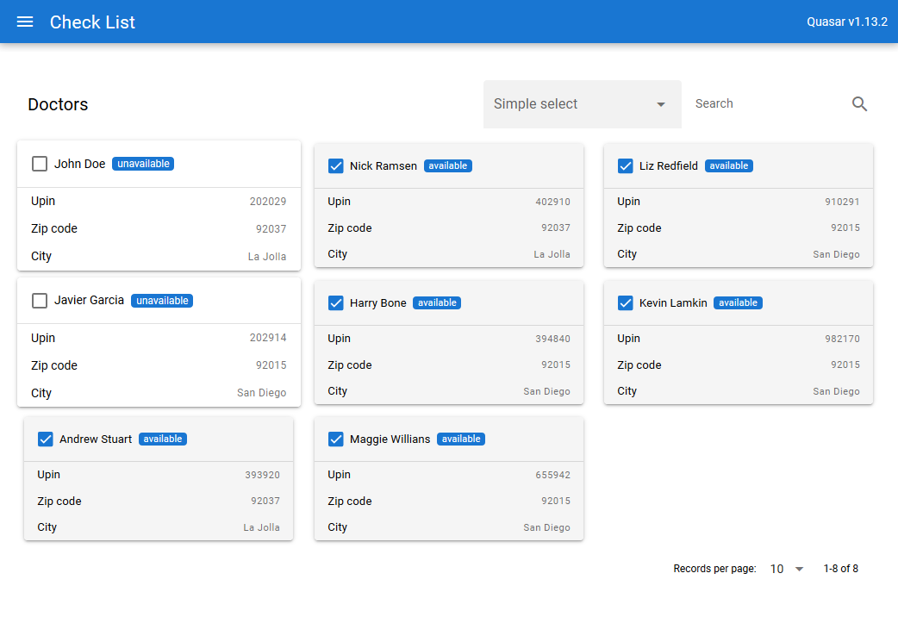

# Doctor List (doctor-list)

Doctors availability list

## The Task

Our operators team prepared a list of enhancements/bugfixes for the page:

1. Available doctors filter is not working.
2. I can't mark my doctors as available and not available, button is not working
3. I find difficult to see wether a doctor is available or not available. Can you add some style to make it easier to differ between available and unavailable doctors?
4. Would be great if we could have a field for searching doctors by name or its Unique Physician Identification Number (UPIN)

Also, we have a checklist from our software architect:

1. Use `searchContainer` div to add the search input component
2. I noticed zipcode and city information are not coming in our ajax API. Would be great if we could have a mapping of this information so we don't lose it when filtering/searching. Keep that in mind when delivering the code.
3. It's important to have commits with clear description and separated by delivered context.
4. Can you add some automated tests for this page?



## Install the dependencies
```bash

$ git clone https://github.com/yohansobrinho/doctor-list.git

$ cd doctor-list

$ npm install

# Node.js >=10 is required.

$ yarn global add @quasar/cli
# or
$ npm install -g @quasar/cli

```
### Start the app in development mode (hot-code reloading, error reporting, etc.)
```bash
quasar dev
```


### Customize the configuration
See [Configuring quasar.conf.js](https://quasar.dev/quasar-cli/quasar-conf-js).
